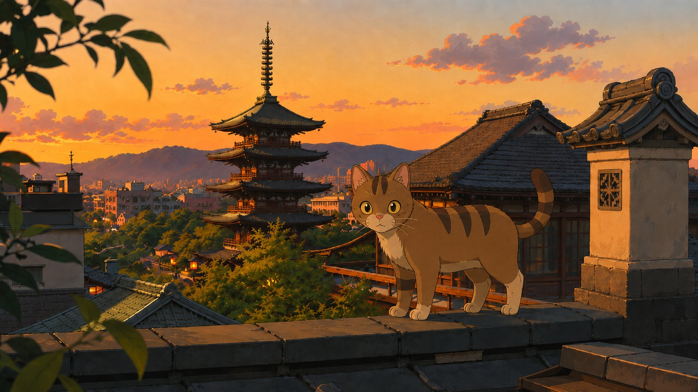
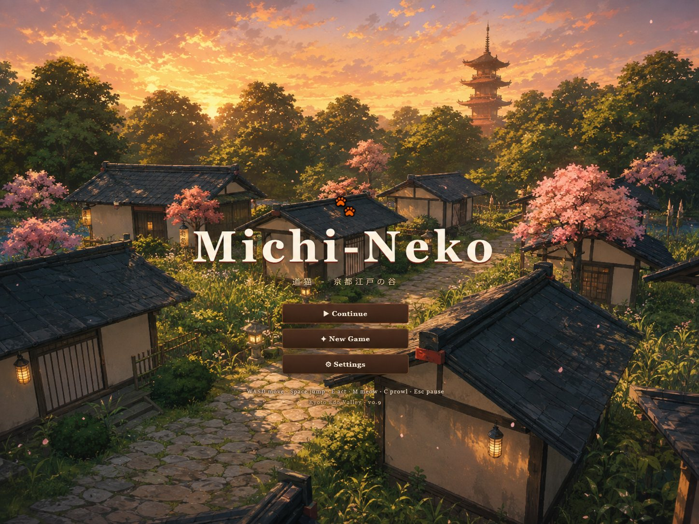
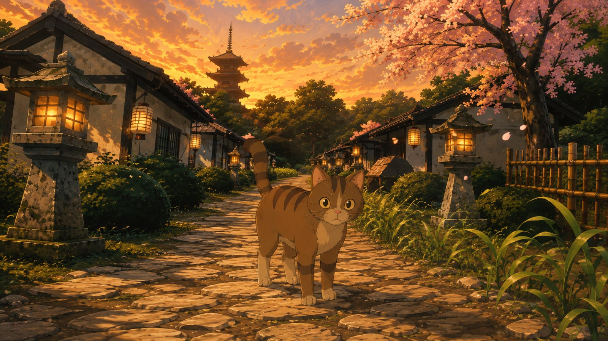
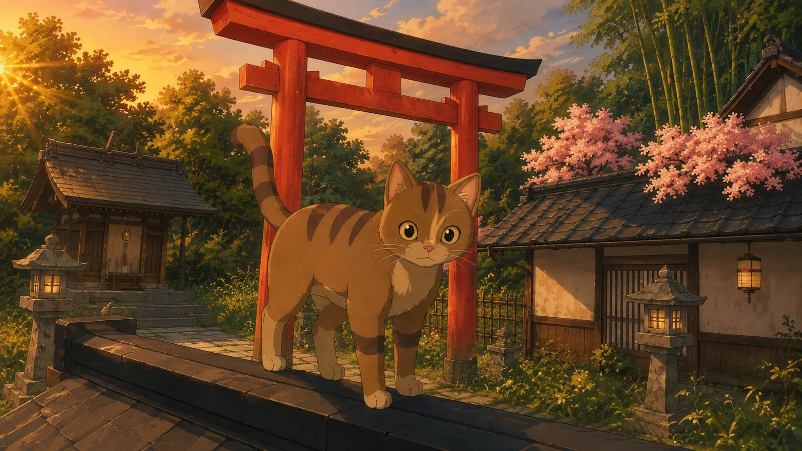
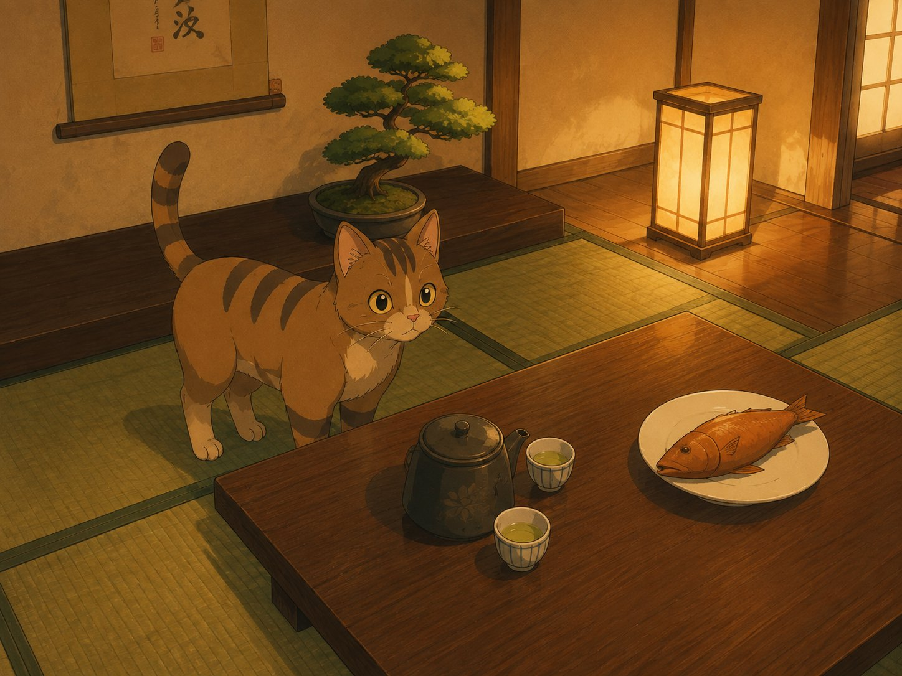

# 🐾 Michi-Neko The Cat Philosopher's Path — 道猫

<p align="center">
  
</p>

### A Third-Person Cat Exploration Game set in a Kyoto-Inspired Valley

**🐾 Ready to explore Kyoto? Play now — free, instant, no install:**

[](https://c1t1zen1.github.io/Michi-Neko-The-Cat-Philosophers-Path/)

*Free · No download · No install · Just click and stroll.*

> **Status:** Very Early Alpha · Built with vibe coding and several SOTA AI models  
> **Inspiration:** Studio Ghibli films and a honeymoon trip to Kyoto, Japan  
> **Engine:** Three.js (r160) · WebGL 2.0 · Pure browser — no dependencies to install  
> **License:** MIT

---

## 🎨 Art & Design Vision

> **✏️ Note on the images in this README:** Michi-Neko is in **very early alpha**. The artwork sprinkled through the sections below is **inspiration art** — it shows the scenery, mood, and style the game's design plans to grow into, not current in-game captures. The playable build already has the heart and the vibe; this is the look it is growing toward.

---

## ✨ About

**Michi-Neko** is a meditative third-person exploration game where you play as a small tabby cat wandering a stylized Kyoto valley. There are no enemies, no timers, and no fail states. You explore a hand-crafted countryside dotted with machiya townhouses, a vermilion torii shrine, a flowing river with koi, bamboo groves, and a hidden tea house waiting to be discovered.

The game was created as an experimental art piece — built primarily through **vibe coding** with several state-of-the-art AI language models. It is very early alpha: the core loop works, the world is beautiful, but much remains to be built. We're sharing it early because we think the vibe is already worth experiencing.

<p align="center">
  <a href="https://c1t1zen1.github.io/Michi-Neko-The-Cat-Philosophers-Path/"></a>
</p>

### Inspirations

- **Studio Ghibli** — the warm, hand-painted aesthetic of films like *The Cat Returns* and *Spirited Away*
- **Kyoto, Japan** — a real honeymoon trip that sparked the vision: machiya streets, torii gates, temple bells, koi ponds, bamboo forests
- **Journey, Outer Wilds, A Short Hike** — exploration-first games that reward curiosity over combat

---

## 🎮 Features (Alpha)

### World & Atmosphere
- **Procedural Kyoto valley** — machiya townhouses, torii shrine gate, stone paths, river with water physics, bamboo groves, cherry trees, and surrounding mountains
- **Dynamic day/night cycle** — a full 24-hour loop compressed to 60 minutes, with sunrise, golden hour, sunset, and night each bringing unique lighting moods
- **Living weather system** — clear, cloudy, rain, snow, and mist states that transition smoothly and affect fog, lighting, and audio
- **Studio Ghibli cel-shading** — the cat avatar uses a custom 3-step toon gradient ramp for anime-style shading
- **Bloom post-processing** — UnrealBloomPass for warm lantern glow and golden hour magic

<p align="center">
  
</p>

### The Cat
- **Fully articulated cat avatar** — segmented body with head, ears, tail, legs, and expressive golden-amber eyes that track objects of interest
- **Cat animations** — walk, sprint, jump (with anticipation squash), land (with impact dust), idle sit, meow, prowl stance, tail swish, ear twitch, mood-based expressions (curious, playful, cautious, alert, sleepy)
- **Prowl mode** — crouch low and move quietly at reduced speed (press C)
- **Scent trail** — warm particle wisps drift up behind the cat as it moves, fading from gold to amber

### Gameplay
- **Yarn ball collectibles** — scattered throughout the valley, each gives XP and triggers a satisfying chime
- **Quest system** — Luna's Yarn Hunt introduces the world and rewards exploration
- **Progression ranks** — Kitten → Curious Cat → Backyard Explorer → Rooftop Wanderer → City Legend, each unlocking sprint, jump boost, and speed upgrades
- **Three NPC cats** — Luna (mysterious moonlight cat), Mochi (cheerful bamboo grove cat), and Kuro (quiet river guardian) — each with unique fur colors, dialogue, and wandering AI
- **Secret tea house** — find the antique key hidden near the bamboo shrine, unlock the machiya door, and step inside a fully modeled Japanese interior with tatami mats, tokonoma alcove, hanging scroll, bonsai, and a zen rock garden
- **Interior interactions** — eat grilled sea bream for a speed boost, curl up on a zabuton cushion for a cozy nap that advances time by 4 hours
- **Rooftop bird's nest** — climb to the highest point to discover a nest with a guardian's feather trophy
- **Shrine bell** — ring the sacred bronze bell at the torii gate for blessings
- **Koi pond** — wade into the river to paw at swimming koi fish or drink fresh water
- **Photo mode** — press P to enter a free-camera photo mode, orbit/zoom, and capture PNG screenshots

<p align="center">
  
</p>

### Audio
- **Generative day-phase music** — a real-time music director that layers a warm pad drone with sparse koto-style plucks, shifting key and mood across dawn, day, dusk, and night
- **Procedural sound effects** — footsteps (grass/water), meow, jump, land, collect chime, bell, splash, purr, door slide, key chime, dream chime, eat, lap water, trill — all synthesized via Web Audio API, no audio files needed
- **Adaptive ambient** — weather-aware ambient layers that crossfade between clear, rain, and mist soundscapes

### UI & UX
- **Japanese parchment scroll HUD** — an emakimono-style collapsible scroll showing yarn count, rank, XP bar, active quest, time/weather, and inventory badges
- **Compass strip** — top-center compass with cardinal directions and POI icons for NPCs, the tea house, and collectibles
- **Objective markers** — screen-space waypoint icons with distance labels and an off-screen edge arrow
- **Title screen** — animated paw logo, cinematic orbit camera, and New Game / Continue / Settings menu
- **Settings panel** — master/music/SFX/ambient volume sliders, camera sensitivity, invert Y, graphics quality (auto/low/medium/high), and hint toggle — all persisted to localStorage
- **Touch controls** — virtual joystick, JUMP, ACT, and MEOW buttons for mobile play
- **Debug overlay** — press F3 for FPS, draw calls, triangle count, and GPU memory info

### Technical
- **Adaptive resolution** — dynamically scales pixel ratio based on measured FPS to maintain smooth performance
- **Camera collision** — soft raycast camera collision prevents clipping through walls
- **Platformer physics** — coyote time, jump buffering, and variable jump height for responsive platforming
- **Save/load** — auto-saves every 12 seconds to localStorage (position, score, XP, quest state, collected items, world state, time of day, weather)
- **Seeded procedural generation** — deterministic world layout using mulberry32 PRNG
- **Instanced particles** — rain, snow, cherry petals, fireflies, dust, and water ripples using pooled instanced meshes

---

## 🚀 Quick Start

**Michi-Neko** is free to play in your browser — no install needed:

[](https://c1t1zen1.github.io/Michi-Neko-The-Cat-Philosophers-Path/)

Prefer to run it locally? You just need a local web server (ES modules require it).

```bash
# Python 3 (built-in on most systems)
py -m http.server 8080 --bind 127.0.0.1

# Or with Node.js
npx serve -l 8080
```

Then open **http://127.0.0.1:8080** in your browser.

> 📖 See **[INSTALL.md](INSTALL.md)** for detailed setup instructions and **[QUICKSTART.md](QUICKSTART.md)** for the extended gameplay guide.

---

## 🎯 Controls

### Desktop

| Key | Action |
|-----|--------|
| `W` `A` `S` `D` / Arrows | Move |
| `Shift` | Sprint (unlocked at rank 2) |
| `Space` | Jump (hold for higher, tap for short hop) |
| `E` | Context action (talk, pick up, interact, enter/exit) |
| `M` | Meow |
| `C` | Toggle prowl mode |
| `P` | Photo mode (orbit camera, capture screenshots) |
| `Esc` | Pause menu |
| `F3` | Debug overlay |
| Mouse drag | Rotate camera (yaw + pitch) |

### Mobile / Touch

| Touch | Action |
|-------|--------|
| Left joystick | Move (push to edge to sprint) |
| JUMP button | Jump |
| ACT button | Context action |
| MEOW button | Meow |
| Swipe right side | Rotate camera |

---

## 📁 Project Structure

```
Michi-Neko-The-Cat-Philosophers-Path/
├── index.html                  # Entry point — HTML, CSS, UI overlays
├── README.md                   # This file
├── INSTALL.md                  # Installation & setup guide
├── QUICKSTART.md               # Extended gameplay manual
├── src/
│   ├── main.js                 # Game class — orchestrates all systems
│   ├── player.js               # Player controller, camera follow, physics
│   ├── cat.js                  # Cat avatar model, toon shading, animations
│   ├── controls.js             # Keyboard, mouse, touch input handling
│   ├── countryside.js          # Procedural Kyoto valley world generation
│   ├── sky.js                  # Sky dome shader, day/night, weather system
│   ├── vegetation.js           # Trees, bamboo, grass, flowers, foliage
│   ├── particles.js            # Rain, snow, petals, fireflies, dust
│   ├── ambient_life.js         # Birds, butterflies, koi fish, guardian crows
│   ├── interior.js             # Tea house interior scene & transitions
│   ├── context_actions.js      # Context-sensitive interaction system
│   ├── npc.js                  # NPC cats with wandering AI & name tags
│   ├── dialogue.js             # Dialogue box system
│   ├── quest.js                # Quest tracking
│   ├── progression.js          # XP, ranks, skill unlocks
│   ├── audio.js                # Web Audio synthesis & spatial audio
│   ├── music.js                # Generative day-phase music director
│   ├── scent.js                # Scent trail particle system
│   ├── ui.js                   # HUD updates, toasts, debug overlay
│   ├── menus.js                # Title screen, pause menu, settings
│   ├── settings.js             # Settings persistence (localStorage)
│   ├── save.js                 # Save/load manager (localStorage)
│   ├── waypoints.js            # Screen-space objective markers & compass
│   └── city_gen/               # City generation utilities
├── SceneManager.js             # Legacy scene manager module
├── AssetManager.js             # Asset loading framework
├── StreamingManager.js         # Chunk streaming framework
├── design/                     # Design documents & specifications
└── *.md                        # Architecture, gameplay spec, neighborhoods
```

---

## 🛠️ Technology Stack

- **Three.js r160** — WebGL rendering, scene graph, post-processing
- **Web Audio API** — all sound and music is procedurally synthesized at runtime
- **ES Modules** — no bundler required; runs directly from a static server
- **Vanilla JavaScript** — no frameworks, no build step, no dependencies
- **localStorage** — save/load and settings persistence

---

## 🗺️ Roadmap

| Feature | Status |
|---------|--------|
| Core world & cat avatar | ✅ Done |
| Day/night & weather | ✅ Done |
| NPCs, dialogue, quests | ✅ Done |
| Interior (tea house) | ✅ Done |
| Progression & save/load | ✅ Done |
| Photo mode | ✅ Done |
| Generative music | ✅ Done |
| Additional zones (park, commercial, industrial) | 🔲 Planned |
| More NPCs & story arcs | 🔲 Planned |
| Cat idle/walk animation polish | 🔲 Planned |
| PWA manifest & offline caching | 🔲 Planned |
| Mobile performance pass | 🔲 Planned |

---

## 🧠 How This Was Made

Michi-Neko was built primarily through **vibe coding** — a collaborative process where human creative direction meets AI code generation. Several state-of-the-art large language models contributed to different parts of the codebase, guided by a human who provided the artistic vision, design decisions, and Kyoto inspiration.

The result is a game that no single developer could have produced this quickly — a testament to the new creative workflows emerging at the intersection of human taste and AI capability. It's rough, it's alpha, and it's made with love.

<p align="center">
  
</p>

---

## 📜 License

MIT License — see [LICENSE](LICENSE) for details.

---

## 🌸 Credits

- **Concept & Design:** Inspired by a honeymoon trip to Kyoto and a lifetime of Studio Ghibli films
- **Code:** Vibe coded with multiple SOTA AI models
- **Engine:** Three.js by Ricardo Cabello (Mr.doob) and contributors
- **Cat avatar:** Custom procedural mesh with Ghibli-style toon shading

---

**🐾 Made it to the end? Go say hello to Michi-Neko:**

[](https://c1t1zen1.github.io/Michi-Neko-The-Cat-Philosophers-Path/)

*猫の散歩 — A cat's stroll through Kyoto. Take your time. There's nowhere you need to be.*
